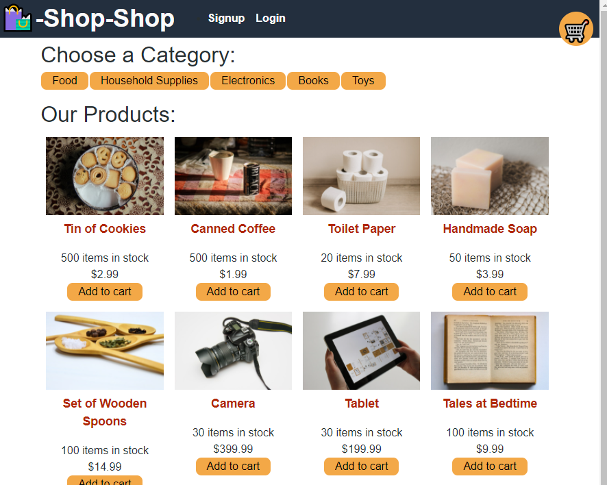

# Redux Store

## License

    This project is licensed with MIT.

## This App is deployed at: <https://tranquil-fortress-24613.herokuapp.com/>

## Description

This app is an e-commerce platform that uses Redux to manage global state. The JavaScript library Redux was utilized to manage complex state in a large-scale React application.

## Table of Contents

1. [License](#license)
2. [Installation](#installation)
3. [Usage](#usage)
4. [Tests](#tests)
5. [Contributing](#contributing)
6. [Questions](#questions)

## Installation

npm i

## Usage

This project will be used as an ecommerce platform.

## Tests

npm run test

## Contributing

Open the heroku app link below to get to the application and navigate around the website. Additionally, a user could run npm i and then npm develop to open the app locally.

## Screenshot 

## Questions

Questions?

You may reach me by email at: <eaim928@gmail.com>

You may also reach me on github: <https://github.com/gim928>
